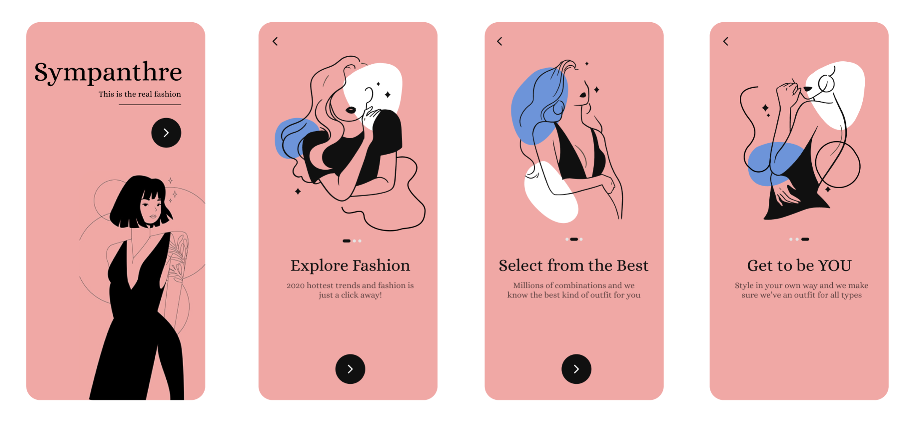

# design_102

The idea of the design has been taken as an inspiration from another design I came across the internet. 

This is a minimalistic template whose use case can be extended from what the design conveys. Currently, it is used to provide an onboarding for a fashion app however this onboarding steps can be used for any other app, for instance, a food-delivery app or a savings platform. It can be used for anything, just be tweaking the colors and the vectors ofcourse. 

As this repo will be participating in the hacktoberfest event, this is the particular app I would like to have PR on. The design for this app is given in link [here](https://www.figma.com/file/6sugjTvQEZJSXwg1ySK6lK/Sympanthre?node-id=0%3A1) with all the used vectors that can be easily exported. 

## Getting Started

This project is a starting point for a Flutter application.

A few resources to get you started if this is your first Flutter project:

- [Lab: Write your first Flutter app](https://flutter.dev/docs/get-started/codelab)
- [Cookbook: Useful Flutter samples](https://flutter.dev/docs/cookbook)

For help getting started with Flutter, view our
[online documentation](https://flutter.dev/docs), which offers tutorials,
samples, guidance on mobile development, and a full API reference.
